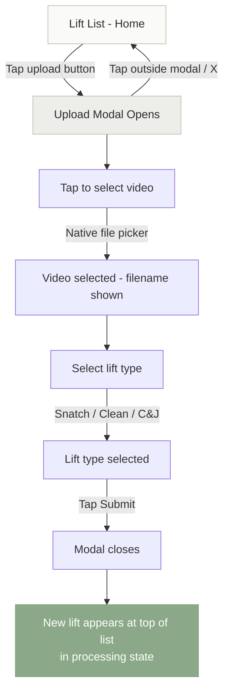
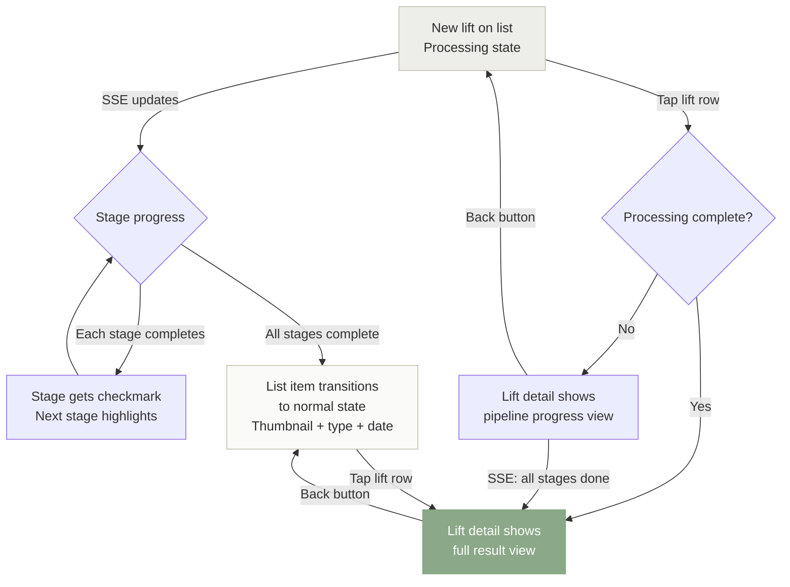
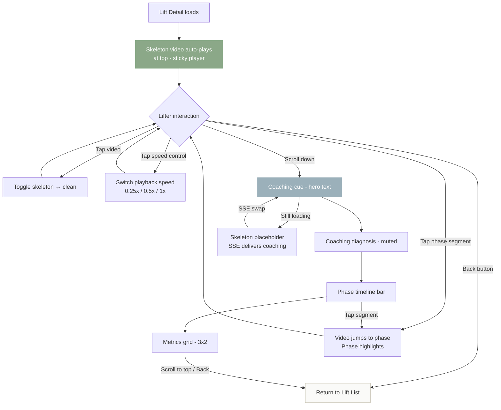

# UX Design Specification press-out

**Author:** joao
**Date:** 2026-03-15

---

<!-- UX design content will be appended sequentially through collaborative workflow steps -->

## Executive Summary

### Project Vision

Press-out is a personal Olympic weightlifting video analysis tool used exclusively between sets at the gym. A lifter uploads a sagittal-view video from their phone, and the system auto-trims, auto-crops, runs pose estimation, renders a skeleton overlay, computes biomechanical metrics, and generates LLM coaching feedback — all within a rest interval. There is no study mode, no deferred review, no separate analysis context. One upload, one view, everything visible at once.

### Target Users

Solo Olympic weightlifter (the lifter is the only user — no auth, no sharing). Intermediate-to-advanced, training at high percentages, with enough technical vocabulary to understand cues like "pull-to-catch ratio" and "punch through the bar." Uses the app on their phone at the gym between sets — sweaty, distracted, resting, mentally preparing for the next attempt. Wants confirmation or correction of what they felt during the lift.

### Key Design Challenges

- **Gym-hostile environment:** Sweaty hands, phone on a bench, glare, limited attention. Every tap must be large, every flow minimal-step, every state self-evident.
- **Dense information on one mobile screen:** Video player (with skeleton toggle and speed controls), coaching cue, six metrics, and phase timeline must coexist on a single scrollable view without cognitive overload.
- **Pipeline wait state:** Processing takes up to ~3 minutes. The screen must communicate progress and completion at a glance from arm's length — the lifter checks their phone between loading plates.

### Design Opportunities

- **Coaching cue as hero element:** The LLM-generated cue is the fastest path to value. Prominent placement means the lifter gets actionable feedback in 2 seconds of glancing at their phone.
- **Skeleton toggle as signature interaction:** Instant, effortless switching between clean and skeleton video is the product's defining moment — the lift becomes "readable."
- **Scroll depth = analysis depth:** Video and coaching at the top (sufficient for most sets), metrics and phase timeline below the fold for deeper review. Natural mobile scroll matches information priority.

## Core User Experience

### Defining Experience

The core loop is: record → upload → wait → glance → lift again. Upload is the entry point and must be minimal-tap (one gesture while sweaty and distracted). Review is the value delivery — the lifter picks up their phone, sees a skeleton-overlaid video with metrics and coaching, and has enough information density and video control to understand what happened in a sub-2-second lift. The lifter is willing to engage with the review; it is not a passive glance but an active workspace.

### Platform Strategy

- Mobile web, Chrome-only, no native app
- Touch-primary interaction — all controls sized for sweaty gym hands
- Server-rendered (Go + HTMX + Tailwind CSS) — no client-side framework
- No offline capability required — gym has connectivity
- No desktop optimization needed — phone is the only context that matters
- Leverage HTML5 video capabilities fully (playback rate API, seeking)

### Effortless Interactions

- **Upload:** Must be near-zero friction. Tap to select video, pick lift type, submit. No cropping, no trimming, no configuration. The system handles everything.
- **Pipeline progress:** Automatic, passive — the lifter puts the phone down and comes back. Progress is visible but requires no interaction.
- **Video default state:** Opens with skeleton overlay playing. No tap required to see the primary analysis view.

Review interactions (scrubbing, speed control, phase navigation, toggle, reading metrics) are intentionally *not* effortless — they are rich and manipulable. The lifter earns insight by engaging with the controls.

### Critical Success Moments

- **"I see more than my camera roll"** — the moment the lifter picks up the phone and sees the skeleton overlay with metrics. The density of information is the proof of value.
- **"I can control this"** — scrubbing to the catch, slowing down the second pull, jumping to a phase. If video manipulation feels tight and responsive, the product earns trust.
- **"That's what happened"** — the coaching cue confirms or challenges what the lifter felt. The causal diagnosis makes the lift legible in words, not just visually.
- **"I know what to try next"** — the physical cue gives the lifter something concrete for the next rep. This closes the loop and makes the app worth opening again.

### Experience Principles

1. **Upload is a single gesture, review is a rich workspace.** Asymmetric effort: near-zero input, high-density output.
2. **Skeleton-first.** The overlay is the default view — the product's lens on the lift. Clean video is the fallback, not the starting point.
3. **Video manipulation is king.** Scrubbing, speed control, phase jumping, and toggle must feel tight and responsive. If the video controls feel clunky, nothing else matters.
4. **Information density over simplicity.** The lifter wants to see everything — metrics, coaching, phases, video. Don't hide content behind tabs or progressive disclosure. Show it all, let scroll handle the hierarchy.

## Desired Emotional Response

### Primary Emotional Goals

- **Clarity:** "Now I understand what happened." The lifter sees something in the skeleton overlay, the metrics, or the coaching cue that they couldn't see in raw video. The lift becomes legible. This is the primary emotional payoff — not excitement, not delight, but the satisfaction of understanding.
- **Trust:** "This thing gets it." When the coaching cue matches what the lifter felt, the tool earns credibility. Trust compounds over sessions — the lifter starts relying on the diagnosis because it's been right before.
- **Seamlessness:** "I didn't even notice." When the pipeline degrades (bad crop, noisy skeleton, missing trim), the lifter shouldn't feel the failure. No error screens, no apologies, no "something went wrong" banners. The result is whatever the system could produce, presented without qualification.

### Emotional Journey Mapping

| Stage | Desired Feeling | Anti-Feeling |
|---|---|---|
| Upload | Effortless, thoughtless | Annoyed by steps, confused by options |
| Waiting (pipeline) | Unbothered, doing something else | Anxious, watching a spinner |
| First glance at result | "Oh, I see it" — clarity hits immediately | Overwhelmed, confused by the layout |
| Video manipulation | In control, engaged | Fighting the controls, laggy response |
| Reading coaching cue | "Yeah, that's what happened" — trust | "That's generic" — distrust, dismissal |
| Returning next set | Reaching for the app without thinking | Deciding whether it's worth the hassle |

### Micro-Emotions

- **Confidence over confusion:** The lifter should never wonder "what am I looking at?" Every element on screen should be self-evident in context. Labels, layout, and visual hierarchy do the explaining — not tooltips or onboarding.
- **Trust over skepticism:** The coaching cue references specific metrics and positions from this lift. It's not generic advice. The lifter can verify the diagnosis against what they see in the skeleton overlay.
- **Calm over anxiety:** The pipeline wait should feel like rest, not waiting. Progress indicators are informational, not urgent. The lifter loads plates, chalks up, and checks back.

### Design Implications

- **Clarity → Visual hierarchy matters more than aesthetics.** The skeleton overlay, coaching cue, and key metrics must be instantly parseable. No decorative elements competing for attention. Contrast, spacing, and font weight do the work.
- **Trust → Coaching must reference the lift.** The cue must cite specific metric values or positions ("your elbows were at X degrees at catch"). Generic advice ("keep your chest up") destroys trust instantly.
- **Seamlessness → No error states in the UI vocabulary.** Degraded results are presented identically to full results. If trim failed, the video is just longer. If a metric couldn't be computed, it's absent — not replaced with "N/A" or "Error."

### Emotional Design Principles

1. **Clarity is the product.** Every design decision should be evaluated against: "Does this help the lifter understand what happened in their lift?" If not, it doesn't belong.
2. **Trust is earned by specificity.** Vague is worse than absent. Every piece of feedback — visual, textual, numeric — must be grounded in this specific lift's data.
3. **Seamlessness means no seams.** The lifter never sees the system struggle. Degradation is invisible. The UI has one mode: "here's what we have."

## UX Pattern Analysis & Inspiration

### Inspiring Products Analysis

**Sports Video Analysis Tools (e.g., Hudl, Coach's Eye, WL Analysis)**
- Best-in-class sports video apps treat the video player as the primary workspace, not a media viewer. Controls are oversized for sideline/gym use. Scrubbing is frame-precise. Slow-motion is a first-class feature, not buried in settings.
- What they get right: video-centric layout where the player dominates the screen and everything else orbits it.
- What they get wrong: most require manual annotation (drawing on frames, tagging positions). Press-out's automation eliminates this entirely.

**Fitness Data Dashboards (e.g., Whoop, TrainingPeaks, Garmin Connect)**
- Dense data on mobile works when the visual hierarchy is strong: one hero metric at the top, supporting metrics below, all scannable without tapping into detail views.
- What they get right: metrics are presented with context (trend arrows, color coding, ranges) so the number is immediately interpretable.
- What they get wrong: many hide data behind tabs or cards that require tapping to expand. This breaks the "show everything" principle.

**Processing Pipeline UIs (e.g., video upload/transcode workflows)**
- The best pipeline UIs show a linear stage progression — a simple list of stages with the current one highlighted. No spinners, no percentage bars (which imply known duration). Just "Stage 3 of 6: Running pose estimation."
- What they get right: the user can leave and come back, and the state is immediately clear.
- What they get wrong: modal progress dialogs that trap the user on the page.

### Transferable UX Patterns

**Video Player Patterns:**
- **Sticky video player:** Video stays pinned at the top of the viewport while the user scrolls through metrics and coaching below. The lifter can scrub and read simultaneously.
- **Tap-to-toggle overlay:** A single tap on the video area switches between skeleton and clean. No button hunt, no menu — the video itself is the toggle target. Large touch area, instant response.
- **Speed control as a persistent strip:** Playback speed options (0.25x, 0.5x, 1x) displayed as a horizontal strip below the video, always visible, tap to select. Not hidden in a menu.

**Data Display Patterns:**
- **Metrics as a compact grid:** Six metrics displayed as a 2x3 or 3x2 grid of labeled values. Each cell: metric name, value, unit. No charts, no graphs — just numbers. Dense, scannable, mobile-friendly.
- **Phase timeline as a segmented bar:** Phases displayed as colored segments of a horizontal bar, proportional to duration, aligned with the video scrubber. Tap a segment to jump to that phase in the video.

**Pipeline Patterns:**
- **Stage checklist:** A vertical list of pipeline stages. Completed stages get a checkmark. Current stage is highlighted. Future stages are dimmed. No animation, no progress percentage — just state.
- **Result replaces progress:** When processing completes, the progress view is replaced entirely by the result view. No "processing complete, click to view" intermediary.

### Anti-Patterns to Avoid

- **Tabs or segmented views for content that fits on one scroll:** Hiding metrics behind a "Metrics" tab and coaching behind a "Coaching" tab forces the lifter to navigate instead of scroll. Everything on one page.
- **Modal overlays for video controls:** Anything that covers the video to present options (speed menu, settings panel) breaks the video-centric experience.
- **Error banners or toast notifications:** "Trim failed" or "Low confidence crop" messages violate seamlessness. The result is the result — no qualifications.
- **Percentage-based progress bars:** The pipeline stages have unpredictable durations. A progress bar that stalls at 47% for two minutes creates anxiety. Stage-based progression is honest.
- **Onboarding tours or tooltips:** Single-user personal tool. The lifter will learn by using it. No "tap here to toggle skeleton" walkthrough.

### Design Inspiration Strategy

**Adopt:**
- Sticky video player with scroll-beneath content layout — this is the structural foundation
- Tap-on-video to toggle skeleton/clean — the signature interaction
- Stage checklist for pipeline progress — honest, calm, glanceable
- Result replaces progress with no intermediary screen

**Adapt:**
- Fitness dashboard metric grids — simplified to raw values without trend indicators (no historical data in MVP)
- Phase timeline bar — adapted to serve as both a visual summary and a video navigation control

**Avoid:**
- Tabbed content organization — contradicts "show everything" principle
- Modal overlays on video — breaks video-centric experience
- Progress percentages — creates false precision and anxiety
- Any form of onboarding or guided tour

## Design System Foundation

### Design System Choice

**Tailwind CSS + DaisyUI** — a utility-first CSS framework with a semantic component layer. DaisyUI provides pre-built CSS component classes (`btn`, `card`, `badge`, `progress`, etc.) on top of Tailwind utilities, delivering consistent design without JavaScript dependencies.

### Rationale for Selection

- **No JS runtime:** DaisyUI is pure CSS — component classes compile to utility classes. Zero conflict with the HTMX server-rendered architecture.
- **Minimal component surface:** Press-out has ~7 distinct UI elements (video player, metric grid, coaching card, phase bar, upload form, lift list, pipeline progress). DaisyUI covers the structural needs (cards, buttons, badges, progress indicators) without overhead for unused components.
- **Built-in theming:** DaisyUI ships with multiple themes and supports custom themes via CSS variables. Easy to establish a dark, high-contrast gym-friendly palette without manual color system design.
- **Solo developer speed:** Semantic class names (`btn-primary`, `card`, `badge-info`) are faster to write and read than raw Tailwind utility chains for common patterns. Reduces decision fatigue during implementation.
- **Chrome-only freedom:** No cross-browser CSS concerns means DaisyUI's modern CSS features work without polyfills or fallbacks.

### Implementation Approach

- **Tailwind CSS:** Standalone CLI (no npm/node required) — compiles to a single CSS file
- **DaisyUI:** Included as a Tailwind plugin via the standalone CLI or CDN
- **Go HTML templates:** Reusable template partials (e.g., `metric-cell.html`, `coaching-card.html`) using DaisyUI classes for consistency across views
- **No custom CSS:** All styling through Tailwind utilities + DaisyUI component classes. No separate stylesheet.

### Customization Strategy

- **Theme:** A single custom DaisyUI theme tuned for gym use — dark background (reduces glare), high-contrast text, large touch targets via Tailwind spacing utilities. Accent color for interactive elements (toggle, phase segments, active speed).
- **Component overrides:** Where DaisyUI defaults don't fit (e.g., video player controls, phase timeline bar), build with raw Tailwind utilities. DaisyUI is the default, not a cage.
- **Typography:** System font stack — no custom fonts to load. Font size and weight hierarchy defined in Tailwind config for consistency across metric labels, coaching text, and UI chrome.

## Defining Interaction

### The One-Liner

"Upload a lift, see what your body actually did."

The defining experience is the moment the lifter picks up their phone and sees the skeleton overlay playing over their lift — body positions, joint angles, and movement timing that were invisible in camera roll footage are now obvious. The auto-trim means they're watching just the lift, not hunting through setup footage. The phase timeline means they can jump straight to the catch or the second pull. The speed strip means slo-mo is one tap away, not buried in a menu.

The skeleton overlay is the visual core. The metrics and phase timeline deepen it. The coaching cue arrives asynchronously and completes it — but the product already delivered value before coaching loads.

### User Mental Model

**Current workflow:** Record lift on phone camera → open camera roll → rewind → watch → pinch/scrub to find the right frame → dig through controls to enable slo-mo → squint at the video trying to see elbow position or bar path → give up and do the next set based on feel.

**Pain points the lifter brings:**
- "I can never find the exact moment I want to see" — scrubbing raw video is imprecise, especially for a sub-2-second lift
- "Slo-mo is always buried" — camera roll slo-mo controls are small, multi-tap, and designed for casual use, not gym urgency
- "I can see the lift but I can't read it" — raw video shows what happened but not why. Joint angles, bar path, and timing relationships are invisible without a trained eye or a skeleton overlay

**Mental model shift:** Press-out doesn't replace the camera roll — it replaces what happens after recording. The lifter still records with their phone camera. But instead of rewinding and squinting, they upload and receive a *readable* version of their lift. The mental model is: "camera records, press-out reads."

### Success Criteria

- The lifter sees the skeleton overlay within the rest interval (~2-3 min) — fast enough to inform the next attempt
- Phase timeline lets the lifter jump to any phase in one tap — no scrubbing through video to find the catch
- Speed control is always visible and one-tap — 0.25x is the default analysis speed for a sub-2-second lift
- Skeleton makes body positions obvious enough that the lifter can answer "where were my elbows at the catch?" by looking, not measuring
- Coaching cue loads asynchronously and appears in place without page refresh (SSE) — the lifter may already be scrubbing when it arrives
- The full package (skeleton + metrics + phases + coaching) is what makes the lifter come back, not any single element

### Novel UX Patterns

**Mostly established patterns, combined in a novel way:**

- Video player with overlay toggle — established (YouTube annotations, sports replay tools)
- Phase timeline as navigation — established (podcast chapters, video chapters)
- Speed control strip — established (video players)
- Metric grid — established (fitness dashboards)
- Async content loading via SSE — established (chat apps, dashboards)

**The novel combination:** No existing tool combines auto-processed skeleton overlay + phase-aware timeline navigation + biomechanical metrics + LLM coaching in a single mobile-first view. Each pattern is familiar; the combination is unique. This means no user education is needed — every individual control is recognizable.

### Experience Mechanics

**1. Initiation (Upload):**
- Lifter taps upload button on the lift list screen
- Selects video from phone gallery (native file picker)
- Picks lift type from a 3-option selector (Snatch / Clean / Clean & Jerk)
- Taps submit — one screen, three interactions, done

**2. Processing (Wait):**
- Screen shows pipeline stage checklist (Trimming → Cropping → Pose estimation → Rendering skeleton → Computing metrics → Generating coaching)
- Completed stages get a checkmark, current stage is highlighted, future stages are dimmed
- Lifter puts phone down, loads plates, chalks up
- When complete, result view replaces progress view automatically (SSE swap)

**3. Review (Interaction):**
- Skeleton video plays automatically at the top of the screen (sticky player)
- Tap the video to toggle between skeleton and clean — instant swap
- Speed strip below video: 0.25x | 0.5x | 1x — always visible, tap to select
- Phase timeline bar below speed strip: colored segments, tap to jump
- Scroll down: metrics grid (6 values), then coaching card (loads async, appears via SSE when ready)

**4. Completion (Loop):**
- There is no "done" state — the lifter reviews as much or as little as they want
- They absorb the coaching cue, internalize a fix, and go lift again
- Next set: record → upload → wait → review → lift. The loop repeats.

## Visual Design Foundation

### Color System

**Aesthetic Direction:** Light, pastel, Scandinavian/Danish design — functional minimalism with muted warmth. The UI is quiet so the content (skeleton overlay, metrics, coaching) is loud.

**DaisyUI Custom Theme:**

- **Base/Background:** Warm white (#FAFAF8) — not pure white, slightly warm to reduce harshness under gym lighting
- **Base Content (text):** Dark charcoal (#2D2D2D) — high readability without the starkness of pure black
- **Primary (accent):** Muted sage (#8BA888) — used for interactive elements: active speed selection, selected phase segment, toggle indicator, upload button
- **Primary Content:** White (#FFFFFF) — text on primary-colored elements
- **Secondary:** Soft stone (#C4BFAE) — used sparingly for borders, dividers, and inactive states
- **Neutral:** Light warm gray (#EDEDEA) — card backgrounds, metric grid cells, subtle separation
- **Info/Coaching:** Soft blue-gray (#9BB0BA) — coaching card accent, to visually distinguish LLM-generated content from metrics
- **Success:** Muted green (#7DA67D) — pipeline stage completion checkmarks

**Color Usage Principles:**
- The video player area has no background styling — the video itself provides all the visual weight
- Metrics use the neutral card background with dark charcoal text — numbers are the focus, not the container
- The coaching card uses the info accent subtly (left border or header tint) to signal "this is generated analysis"
- Phase timeline segments use graduated pastel tones (sage family) to distinguish phases without visual noise
- No reds, no warnings, no error colors — consistent with "no error states in the UI vocabulary"

### Typography System

**Font Strategy:** System font stack — native, fast, no loading. Clean sans-serif appearance across platforms.

**System Font Stack:**
```css
font-family: -apple-system, BlinkMacSystemFont, "Segoe UI", system-ui, sans-serif;
```

On iOS/Safari (unlikely but covered) this renders as San Francisco. On Chrome Android, this renders as Roboto. Both are clean, geometric-leaning sans-serifs that match the Danish design aesthetic.

**Type Scale (Tailwind defaults, customized):**

| Element | Size | Weight | Usage |
|---|---|---|---|
| Page title | text-xl (20px) | font-semibold | "Snatch — Mar 15" on lift detail |
| Section header | text-lg (18px) | font-medium | "Coaching", "Metrics" labels |
| Metric value | text-2xl (24px) | font-bold | The number itself (e.g., "1.32") |
| Metric label | text-xs (12px) | font-medium | "Pull-to-Catch Ratio" below the value |
| Body text | text-sm (14px) | font-normal | Coaching diagnosis and cue text |
| UI chrome | text-xs (12px) | font-medium | Speed strip labels, phase names, timestamps |

**Typography Principles:**
- Metric values are the largest text on screen — numbers should be instantly scannable
- Coaching text is body-sized (14px) — readable but not competing with metrics for visual hierarchy
- UI chrome (labels, controls) is small and quiet — functional, not decorative
- Generous line height (1.5-1.6) on coaching text for readability between sets
- No uppercase transforms, no letter-spacing adjustments — clean and natural

### Spacing & Layout Foundation

**Spacing Unit:** Tailwind's default 4px base. All spacing uses Tailwind's scale (p-2 = 8px, p-4 = 16px, p-6 = 24px, etc.).

**Layout Strategy:**
- Single-column, full-width on mobile — no side margins beyond p-4 (16px) page padding
- Content stacks vertically: video → controls → metrics → coaching
- Cards use p-4 internal padding with rounded-lg corners (DaisyUI card defaults)
- Gaps between major sections: gap-4 (16px) — tight but not cramped
- Metric grid: 2 columns on mobile (3x2 grid), gap-3 (12px) between cells

**Touch Target Sizing:**
- Minimum tap target: 44x44px (Apple HIG recommendation)
- Speed strip buttons: h-10 (40px) minimum height, full horizontal width divided equally
- Phase timeline segments: minimum 44px tall, width proportional to phase duration
- Upload button: full-width, h-12 (48px), prominent sage accent
- Video toggle: the entire video surface is the tap target — no small button

**Layout Principles:**
- **Generous vertical spacing, tight horizontal spacing.** The phone is narrow but long — use the scroll axis generously.
- **Cards as containers, not decorations.** DaisyUI cards provide subtle background separation (neutral on warm white) without borders or shadows. Danish design: the structure is the ornament.
- **Video is edge-to-edge.** The video player has no horizontal padding — it spans the full viewport width. Everything below has page padding. This gives the video maximum screen real estate.

### Accessibility Considerations

- **Not a formal requirement** (single-user personal tool per PRD), but good contrast is free and serves gym readability
- Dark charcoal (#2D2D2D) on warm white (#FAFAF8) = contrast ratio ~12:1 (exceeds WCAG AAA)
- Muted sage (#8BA888) on warm white = contrast ratio ~3.5:1 (acceptable for large text and interactive elements, not for small body text)
- All interactive sage elements use white text on sage background (contrast ratio ~4.8:1) or are large enough to not require WCAG compliance
- Phase timeline uses color + position (not color alone) to communicate which phase is selected

## Design Direction Decision

### Design Directions Explored

Five lift detail variations were generated exploring different information hierarchies:
- **A: Stacked Flow** — linear sequential layout, coaching before metrics
- **B: Coaching Hero** — coaching cue as hero element, horizontal metric strip
- **C: Compact Dense** — maximum information density, 3-column metrics, no scroll
- **D: Card Sections** — content areas in separate cards with shadows
- **E: Minimal Float** — speed controls over video, coaching as hero text, maximum whitespace

Three shared screens (lift list, upload, pipeline progress) were designed as universal components across all directions.

Full interactive mockups: `_bmad-output/planning-artifacts/ux-design-directions.html`

### Chosen Direction

**Direction E: Minimal Float** for the lift detail view.

**Key characteristics:**
- Speed controls (0.25x, 0.5x, 1x) float over the bottom of the video with a subtle gradient backdrop — no separate control strip consuming vertical space
- Coaching cue rendered as large hero text (17px, semibold) immediately below the video — the first thing the lifter reads
- Coaching diagnosis in smaller muted text below the cue, separated by a divider
- Phase timeline as a rounded segmented bar below coaching
- Metrics in a 3x2 grid of compact cells with neutral backgrounds
- Generous whitespace between sections — the layout breathes

**Shared screens adopted as-is:**
- **Lift list (F):** Simple list rows with thumbnail, lift type, date. Upload button top-right. Tap row to open detail.
- **Upload (G):** Centered upload zone (tap to select), 3-option lift type selector, full-width submit button. Three interactions total.
- **Pipeline progress (H):** Vertical stage checklist. Checkmarks for completed, pulsing indicator for active, dimmed for pending. Result replaces progress automatically via SSE.

### Design Rationale

- **Minimal Float aligns with Danish design aesthetic:** Whitespace is the primary design element. The UI gets out of the way and lets the content — skeleton video, coaching cue, metrics — speak.
- **Floating speed controls maximize video area:** No dedicated strip below the video means the player feels larger. Controls appear over the video's bottom edge and are still easily tappable.
- **Coaching-first hierarchy matches the emotional goal:** "Now I understand what happened" is delivered by the coaching cue text, which is the first content below the video. The lifter reads the cue, then optionally scrolls to metrics for depth.
- **3x2 metric grid balances density and readability:** Six metrics visible without being cramped. Each cell has enough padding to feel distinct.

### Implementation Approach

- **Video player:** Full-width, edge-to-edge, with `position: relative` container. Speed controls absolutely positioned at bottom with gradient overlay.
- **Skeleton/clean toggle:** Tap anywhere on video surface to toggle. Small "Skeleton" / "Clean" indicator badge in bottom-right corner of video.
- **Coaching section:** Rendered below video with generous padding (p-4). Cue in `text-lg font-semibold`, diagnosis in `text-sm text-gray-500`. Bottom border separator.
- **Phase timeline:** DaisyUI-styled segmented bar with rounded corners, each segment colored from the sage gradient palette. Tap to seek video.
- **Metrics grid:** 3-column CSS grid (`grid-cols-3`), DaisyUI card components with neutral background, centered text. Value large and bold, label tiny below.
- **Coaching async loading:** Coaching section placeholder shows a subtle loading skeleton (DaisyUI skeleton component) until SSE delivers the coaching content, which swaps in via HTMX `hx-swap`.
- **All screens server-rendered:** Go HTML templates with HTMX attributes. No client-side rendering except video playback controls.

## User Journey Flows

### Upload Flow

The upload is a modal over the lift list — the lifter never leaves home. Three interactions: select video, pick lift type, submit. The modal closes and the new lift appears at the top of the list in a processing state.



**Key decisions:**
- Modal keeps the lifter mentally anchored to the list — no navigation, no "where am I?" moment
- File picker is the native OS picker — no custom upload UI, no drag-and-drop
- Lift type is a 3-option selector, not a dropdown — all options visible, one tap
- Submit is disabled until both video and lift type are selected
- On submit: modal closes immediately, no confirmation step

### Processing → Result Flow

After upload, the new lift sits at the top of the lift list showing pipeline stages inline. SSE pushes stage updates. When processing completes, the list item transitions to its normal state (thumbnail, lift type, date). The lifter can tap into the lift at any point.



**Key decisions:**
- Pipeline stages visible on the list item itself — the lifter glances at their phone from across the platform and sees "4 of 6 done"
- Tapping a processing lift opens the detail view with the full stage checklist (same as shared screen H from step 9)
- If the lifter is on the detail page when processing completes, the result view replaces the progress view automatically via SSE — no "click to view" intermediary
- The lifter is never trapped — back button always returns to the list

### Review & Analysis Flow

The lift detail screen is a single scrollable page following Direction E (Minimal Float). The lifter engages with video controls, reads coaching, reviews metrics, then returns to the list.



**Key decisions:**
- Video auto-plays with skeleton overlay on load — no tap needed to see the primary analysis view
- All interactions are non-linear — the lifter can toggle, scrub, change speed, jump phases, and scroll in any order
- Coaching section shows a loading skeleton if LLM hasn't returned yet; content swaps in silently via SSE when ready
- Phase timeline serves dual purpose: visual summary of lift structure + navigation control for the video
- There is no "done" action — the lifter absorbs what they need and hits back

### Journey Patterns

**Entry/Exit Pattern:**
- Single entry point: lift list is always home
- Modal for creation (upload) — never navigates away from home
- Detail view for consumption (review) — one level deep, back button returns
- Maximum navigation depth: 2 (list → detail)

**Progressive Content Delivery:**
- Upload → immediate list item with processing state
- Processing stages → delivered via SSE, no polling, no refresh
- Result → replaces progress automatically
- Coaching → arrives async, swaps into existing layout via SSE
- The lifter never waits on a loading screen — content appears as it becomes available

**Feedback Pattern:**
- Processing: stage checklist with checkmarks (honest, not percentage-based)
- Video state: small badge indicator ("Skeleton" / "Clean") confirms current mode
- Speed: active speed option visually highlighted
- Phase: selected segment highlighted, video position confirms the jump

### Flow Optimization Principles

1. **Zero-navigation upload.** The modal pattern means the lifter never leaves the list to upload. Three taps (video, lift type, submit) and they're done. The phone goes back on the bench.
2. **Ambient processing.** Progress is visible on the list without entering the detail view. The lifter checks by glancing, not by tapping into a screen and then backing out.
3. **No dead ends.** Every screen has exactly one way back (back button → list). No branching navigation, no settings, no menus. The app has two views: list and detail.
4. **Content before chrome.** Coaching cue is the first thing below the video — not controls, not labels, not section headers. The most valuable content occupies the most valuable screen real estate.
5. **Async is invisible.** Coaching loads via SSE into a placeholder. The lifter may already be scrubbing video when it appears. No "coaching ready!" notification — it just exists when they scroll to it.

## Component Strategy

### Design System Components

**DaisyUI components used directly:**

| DaisyUI Component | Usage | Customization |
|---|---|---|
| `modal` | Upload modal shell | Dark backdrop, centered, tap-outside-to-close |
| `btn` | Upload button, submit button, back button | Sage accent for primary actions, system font |
| `btn` group / `join` | Lift type selector (Snatch / Clean / C&J) | 3 options always visible, single-select, sage highlight on selected |
| `badge` | Skeleton/Clean indicator on video, lift type labels on list | Small, positioned absolute on video corner |
| `skeleton` | Coaching placeholder while LLM processes | Matches coaching card dimensions, subtle pulse |
| `card` | Metric cell containers, coaching card | Neutral background (#EDEDEA), no shadow, rounded-lg |

### Custom Components

#### Video Player with Floating Controls

**Purpose:** Primary analysis workspace — plays skeleton or clean video with instant toggle and speed control.
**Anatomy:**
- Full-width video element (edge-to-edge, no horizontal padding)
- `position: relative` container
- Floating speed strip at bottom: three buttons (0.25x, 0.5x, 1x) over a subtle gradient backdrop (`bg-gradient-to-t from-black/40`)
- Small badge in bottom-right corner showing current mode ("Skeleton" / "Clean")
- Entire video surface is the tap target for toggle

**States:**
- Playing (skeleton) — default on load
- Playing (clean) — after tap toggle
- Paused — user paused via native controls
- Speed active — highlighted speed option (sage accent)

**Interaction:**
- Tap video area → toggle skeleton/clean, badge updates
- Tap speed button → change playback rate via HTML5 `playbackRate` API
- Native scrub bar for seeking
- Sticky positioning: video stays pinned at viewport top while scrolling

#### Pipeline Stage Checklist

**Purpose:** Communicates processing progress — used both inline on lift list items and full-page on lift detail during processing.
**Anatomy:**
- Vertical list of 6 stages: Trimming → Cropping → Pose estimation → Rendering skeleton → Computing metrics → Generating coaching
- Each stage: icon + label

**States per stage:**
- Pending — dimmed text, no icon
- Active — highlighted text, pulsing dot indicator
- Complete — muted text, checkmark icon (sage green)

**Variants:**
- **Compact** (lift list item): Single line showing current stage name + "3 of 6" count, no full stage list
- **Full** (detail view during processing): All 6 stages visible as a vertical checklist

**Interaction:**
- No user interaction — display only
- SSE updates swap stage states in real-time via HTMX `hx-swap`

#### Phase Timeline Bar

**Purpose:** Visual summary of lift phase structure + navigation control for video seeking.
**Anatomy:**
- Horizontal segmented bar, full-width, rounded corners (rounded-lg)
- Each segment proportional to phase duration
- Segments colored from sage gradient palette, distinguishable but harmonious
- No labels visible by default

**States:**
- Default — all segments at normal opacity
- Selected — tapped segment highlighted (full opacity + slight scale), other segments dimmed, label appears above selected segment (e.g., "2nd Pull — 0.31s")

**Interaction:**
- Tap segment → video seeks to phase start time, segment enters selected state
- Label appears on tap, disappears when another segment is tapped or video plays past the phase

#### Metric Cell

**Purpose:** Compact display of a single metric with visualization, inside the 3x2 grid.
**Anatomy:**
- DaisyUI card base (neutral background, rounded-lg, p-3)
- Metric-specific visualization (upper portion of cell)
- Metric label below visualization (text-xs, font-medium, muted)

**Variants by metric:**

| Metric | Compact Visualization | Tap-to-Expand |
|---|---|---|
| Pull-to-Catch Ratio | Vertical ratio bar (two proportional segments: pull height vs. catch depth) + large numeric value (e.g., "1.32") | No expand — compact view is sufficient |
| Bar Path | Mini X-Y trajectory line plot with faint vertical reference line, dot at start, arrowhead at top | Expanded plot with axis labels, phase transition markers, numeric drift values |
| Velocity Curve | Mini sparkline (time vs. velocity), peak value displayed as number | Expanded chart with phase regions shaded, numeric values at key points |
| Joint Angles | Mini stick figure silhouette at catch position with angle values annotated on joints | All four key positions side by side with full angle annotations |
| Phase Durations | Mini horizontal stacked bar (sage gradient segments), total duration as number | Each phase labeled with individual duration in milliseconds |
| Total Lift Duration | Large numeric value (e.g., "1.84s"), label below | No expand — simple number |

**Metric Grid Layout (3x2):**

| Col 1 | Col 2 | Col 3 |
|---|---|---|
| Pull-to-Catch Ratio | Bar Path | Velocity Curve |
| Joint Angles | Phase Durations | Total Lift Duration |

**Interaction:**
- Tap cell (for expandable metrics) → modal or overlay with detailed visualization
- Non-expandable cells (pull-to-catch ratio, total duration) have no tap action

#### Coaching Card

**Purpose:** Delivers LLM-generated coaching feedback — the fastest path to actionable value.
**Anatomy:**
- No card container — rendered directly below video with generous padding (p-4)
- Coaching cue: `text-lg font-semibold` — hero text, the first thing the lifter reads
- Divider (subtle border)
- Coaching diagnosis: `text-sm text-gray-500` — muted, supporting detail explaining the causal chain
- Left border accent in info color (#9BB0BA) to signal "this is generated analysis"

**States:**
- Loading — DaisyUI skeleton placeholder matching card dimensions
- Loaded — cue + diagnosis text, swapped in via SSE

**Interaction:**
- No direct interaction — read-only content
- Content appears silently via SSE when LLM responds

#### Lift List Item

**Purpose:** Represents a single lift on the home list — dual-state depending on processing status.
**Anatomy (normal state):**
- Row layout: thumbnail (small, left) + lift type + date (right-aligned or below)
- Tap entire row to open lift detail

**Anatomy (processing state):**
- Row layout: lift type + date + compact pipeline indicator (current stage name + "N of 6")
- SSE updates the stage indicator in real-time
- On completion: row transitions to normal state (thumbnail appears, pipeline indicator removed)

**Interaction:**
- Tap row → navigate to lift detail (regardless of processing state)

#### Upload Modal

**Purpose:** Minimal-step video upload — three interactions, never leaves the list.
**Anatomy:**
- DaisyUI modal shell with dark backdrop
- File selector zone: tap to trigger native file picker, shows filename after selection
- Lift type selector: 3-option `join` group (Snatch / Clean / C&J), all visible, tap to select
- Submit button: full-width, sage accent, `h-12` (48px)
- Close: tap outside modal or X button

**States:**
- Empty — file selector and lift type unselected, submit disabled (dimmed)
- Partial — one of file or lift type selected, submit still disabled
- Ready — both selected, submit enabled (sage accent)
- Submitting — brief disabled state while upload initiates

**Interaction:**
- Tap file zone → native OS file picker
- Tap lift type option → select (deselects others)
- Tap submit → upload starts, modal closes, new lift appears on list in processing state

#### Metric Expanded View

**Purpose:** Detailed visualization for metrics that support tap-to-expand (bar path, velocity curve, joint angles, phase durations).
**Anatomy:**
- Overlay or modal displaying the full-size visualization
- Metric title at top
- Detailed chart/diagram with labels, values, and annotations
- Tap outside or X to dismiss

**Interaction:**
- Opened by tapping an expandable metric cell
- Tap outside / X → returns to lift detail scroll position

### Component Implementation Strategy

**Approach:** DaisyUI for structural components (modals, cards, buttons, badges, loading states), raw Tailwind utilities for custom components (video player, phase timeline, metric visualizations). No custom CSS files — all styling through class-based utilities.

**Go Template Partials:**
Each custom component maps to a reusable Go HTML template partial:
- `video-player.html` — video element + floating controls + toggle logic
- `pipeline-stages.html` — stage checklist (accepts a `variant` param: compact or full)
- `phase-timeline.html` — segmented bar with HTMX attributes for video seeking
- `metric-cell.html` — per-metric partial (dispatches to metric-specific sub-templates)
- `metric-ratio.html`, `metric-barpath.html`, `metric-velocity.html`, `metric-angles.html`, `metric-durations.html`, `metric-duration-total.html`
- `coaching-card.html` — cue + diagnosis with SSE placeholder
- `lift-list-item.html` — dual-state row (accepts processing status)
- `upload-modal.html` — modal with form elements

**Client-Side Behavior (minimal JS, no framework):**
- Video toggle: swap `<video>` `src` attribute between skeleton and clean URLs
- Speed control: set `video.playbackRate` on button tap
- Phase seek: set `video.currentTime` on segment tap
- Metric expand: DaisyUI modal triggered by tap
- Everything else: HTMX + SSE

### Implementation Roadmap

**All MVP — no phasing.** Press-out has a small component surface (~8 custom components) and a single developer. Building them sequentially as the pipeline steps are built (per the brainstorming 10-step plan):

| Build Step | Components Needed |
|---|---|
| Step 7 (Video Player UI) | Video Player with Floating Controls, Lift List Item (normal state), Upload Modal |
| Step 8 (Lift Classification) | Lift type selector (already part of Upload Modal) |
| Step 9 (Phase Segmentation) | Phase Timeline Bar |
| Step 10 (LLM Coaching) | Coaching Card, Pipeline Stage Checklist, Lift List Item (processing state), all Metric Cells |

Each component is built when its data source becomes available — no premature UI work.

## UX Consistency Patterns

### Button Hierarchy

**Three tiers of interactive elements, visually distinct:**

| Tier | Styling | Usage | Examples |
|---|---|---|---|
| **Primary action** | Sage fill (#8BA888), white text, full-width, h-12 (48px) | One per screen, the thing the lifter came to do | Upload button on list, Submit in upload modal |
| **Interactive control** | Transparent background, sage text/border when active, h-10 (40px) | Repeated, toggleable, part of the workspace | Speed buttons (0.25x/0.5x/1x), lift type selector options |
| **Navigation** | No background, dark charcoal icon/text, standard touch target (44px) | Moving between views | Back button on detail view, X on modal |

**Rules:**
- Only one primary action visible per screen context — the lift list has the upload button, the upload modal has the submit button, the detail view has none (it's a consumption view)
- Interactive controls show active state with sage accent — the currently selected option is always visually obvious
- Navigation elements are visually quiet — they exist but don't compete with content

### Loading & Async State Patterns

**Principle:** Content appears progressively. Nothing blocks. Nothing announces itself.

**Pattern 1: Pipeline Progress (list item)**
- **Trigger:** Video uploaded, processing begins
- **Display:** Compact inline indicator on list item — current stage name + "N of 6"
- **Update mechanism:** SSE pushes new HTML fragment, HTMX swaps the indicator
- **Completion:** Entire list item row transitions to normal state (thumbnail + type + date) — no "done" notification, the normal state IS the notification

**Pattern 2: Pipeline Progress (detail view)**
- **Trigger:** Lifter taps into a processing lift
- **Display:** Full vertical stage checklist — checkmarks, pulsing active, dimmed pending
- **Update mechanism:** SSE pushes stage state changes
- **Completion:** Entire progress view replaced by result view — no intermediary "click to view"

**Pattern 3: Coaching Placeholder**
- **Trigger:** Lift detail loads before LLM has responded
- **Display:** DaisyUI skeleton component matching coaching card dimensions — subtle pulse animation, no text, no "loading coaching..." label
- **Update mechanism:** SSE delivers coaching HTML, HTMX swaps skeleton for content
- **Completion:** Coaching cue + diagnosis appear in place — if the lifter is scrolled past the coaching area, they see it next time they scroll up

**Pattern 4: Metric Expand**
- **Trigger:** Lifter taps an expandable metric cell
- **Display:** Modal opens instantly with detailed visualization — no loading state (data is already available, just rendering a larger view)
- **Dismiss:** Tap outside or X

**Consistency rule:** Every async pattern follows the same principle — placeholder exists at the right size, content swaps in silently, nothing announces completion. The lifter discovers new content by looking, not by responding to alerts.

### Navigation Patterns

**App structure:** Two views (list, detail) + one modal (upload). Maximum depth: 2.

**Pattern: List → Detail**
- **Trigger:** Tap lift row
- **Transition:** Full page navigation (server-rendered new page via standard link or HTMX boost)
- **Back:** Browser back button or explicit back button at top of detail view
- **State preservation:** List scroll position preserved on back (browser default behavior)

**Pattern: Upload Modal**
- **Trigger:** Tap upload button on list
- **Open:** DaisyUI modal with dark backdrop overlay
- **Close:** Tap outside modal, tap X, or successful submit
- **After submit:** Modal closes, list updates with new processing item at top — no page navigation occurred

**Pattern: Metric Expand Modal**
- **Trigger:** Tap expandable metric cell on detail view
- **Open:** DaisyUI modal with detailed visualization
- **Close:** Tap outside or X
- **After close:** Return to exact scroll position on detail view

**Rules:**
- No nested modals — upload modal and metric expand modal are never open simultaneously
- No horizontal navigation (no tabs, no side drawers, no swipe between lifts)
- Back always means "up one level toward the list" — never ambiguous

### Video Interaction Patterns

**Principle:** The video player is the workspace. Every interaction is immediate, reversible, and stateless (no modes to get stuck in).

**Pattern: Toggle (skeleton ↔ clean)**
- **Trigger:** Tap anywhere on video surface
- **Response:** Video `src` swaps, playback continues from same timestamp and speed
- **Feedback:** Badge in bottom-right updates ("Skeleton" → "Clean" or vice versa)
- **Latency target:** < 500ms (NFR4) — pre-rendered videos, no processing on swap

**Pattern: Speed Control**
- **Trigger:** Tap speed button (0.25x, 0.5x, 1x)
- **Response:** `video.playbackRate` updates immediately
- **Feedback:** Tapped button gets sage accent, others lose accent
- **Default:** No default speed is pre-selected on load — video plays at 1x, lifter selects 0.25x when they want detail

**Pattern: Phase Seek**
- **Trigger:** Tap phase segment on timeline bar
- **Response:** `video.currentTime` jumps to phase start timestamp
- **Feedback:** Tapped segment highlights (full opacity, slight scale), label appears above ("2nd Pull — 0.31s"), other segments dim
- **Persistence:** Highlight clears when video plays past the phase end or another segment is tapped

**Pattern: Native Scrub**
- **Trigger:** Drag on native HTML5 video scrub bar
- **Response:** Standard browser behavior — frame-accurate seeking
- **No customization:** The native scrub bar works well enough on Chrome mobile. No custom scrub bar.

**Consistency rule:** Every video interaction is a single tap. No long-press, no double-tap, no swipe gestures. One tap = one action, always reversible by tapping again or tapping something else.

### Content State Transitions

**Principle:** Every piece of content has exactly two states — not-yet-available and available. There is no third state (error, partial, retry). Transitions are one-way and permanent within a session.

**Transition 1: Processing → Result**
- **Scope:** Entire lift detail view
- **Mechanism:** SSE delivers complete result HTML when pipeline finishes, HTMX swaps the full content area
- **Visual:** No animation — the result simply appears. The stage checklist is gone; the video + coaching + metrics are there.
- **Reversibility:** None needed — processing doesn't re-occur

**Transition 2: Placeholder → Coaching**
- **Scope:** Coaching card section within an already-loaded result view
- **Mechanism:** SSE delivers coaching HTML fragment, HTMX swaps the skeleton placeholder
- **Visual:** Skeleton pulse stops, text appears in place. No fade-in, no slide-down.
- **Timing:** May happen while lifter is watching video above — coaching appears silently below the fold

**Transition 3: Compact Metric → Expanded Metric**
- **Scope:** Single metric cell → modal overlay
- **Mechanism:** Tap triggers DaisyUI modal with pre-rendered detailed visualization
- **Visual:** Modal opens over current view, detail view remains underneath
- **Reversibility:** Tap outside or X to dismiss, return to detail view

**Transition 4: List Item Processing → Normal**
- **Scope:** Single row on lift list
- **Mechanism:** SSE delivers updated list item HTML when pipeline completes, HTMX swaps the row
- **Visual:** Stage indicator disappears, thumbnail + type + date appear. No animation.

**Consistency rule:** All transitions are HTML fragment swaps via HTMX. No client-side state management, no CSS transitions between content states, no JavaScript animation. The server decides what to show; the browser shows it.

## Responsive Design & Accessibility

### Responsive Strategy

**Mobile-only.** Press-out is designed exclusively for a phone screen in Chrome. There is no tablet layout, no desktop layout, no responsive breakpoints.

- **Target viewport:** ~375px–430px width (standard modern phone range)
- **Orientation:** Portrait only — no landscape optimization
- **Desktop:** Not considered. If opened on desktop, the layout renders as-is with no max-width container or adaptation. It may look stretched; that's acceptable.
- **Breakpoints:** None. Single-column layout at all widths. Tailwind's default responsive prefixes (`sm:`, `md:`, `lg:`) are not used.

**Layout is inherently fluid:**
- Video player: full viewport width at any size (edge-to-edge)
- Content sections: full width minus `p-4` (16px) page padding
- Metric grid: `grid-cols-3` at all widths — cells flex to fill available space
- All text uses relative units via Tailwind's default type scale

### Accessibility Strategy

**Not a formal requirement.** The PRD explicitly scopes this as a single-user personal tool with no accessibility compliance obligation.

**What we get for free (by design, not by requirement):**
- Text contrast exceeds WCAG AAA: dark charcoal (#2D2D2D) on warm white (#FAFAF8) = ~12:1 ratio
- Touch targets meet Apple HIG minimums: 44x44px for all interactive elements, 48px for primary buttons
- Semantic HTML: server-rendered Go templates produce proper heading hierarchy, button elements, native form controls
- Native video controls: HTML5 `<video>` element provides built-in keyboard and assistive technology support
- Phase timeline uses color + position (not color alone) to indicate selection

**What we explicitly skip:**
- ARIA labels and roles beyond what semantic HTML provides
- Keyboard navigation testing or optimization
- Screen reader testing
- Skip links or focus management
- High contrast mode
- Reduced motion preferences

### Testing Strategy

**No dedicated responsive or accessibility testing.**

- **Device testing:** The developer (joao) tests on their own phone in Chrome. That's the target device.
- **Browser testing:** Chrome only. No Firefox, Safari, or Edge testing.
- **Accessibility testing:** None. If semantic HTML and high-contrast colors work, that's sufficient.
- **Automated testing:** Chromedp headless browser tests (per brainstorming build plan) verify that elements render and interactions work. These tests run at a default viewport size — no multi-device simulation.

### Implementation Guidelines

**Keep it simple:**
- Use Tailwind utilities without responsive prefixes — write styles once for mobile, no breakpoint variants
- Use semantic HTML elements (`<button>`, `<nav>`, `<main>`, `<h1>`–`<h3>`) because they're the right elements, not for accessibility compliance
- Use native `<video>` element — don't rebuild video controls
- Use native `<input type="file">` — don't build a custom file picker
- Use `<dialog>` element (Chrome-only freedom) for modals when DaisyUI's modal approach allows it
- No `@media` queries in custom styles — if it works on a phone, it works
